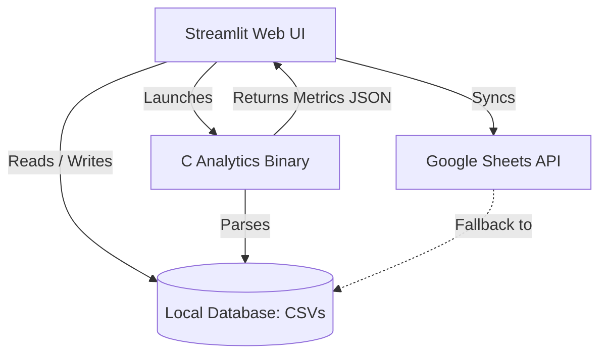

# 📅 Automated Attendance Tracker

An enterprise-grade, automated weekly attendance tracking application engineered with a **Streamlit** frontend and a high-performance **C backend**. The system features a modern glassmorphic dark user interface, predictive attendance analytics (permissible absence recommendations based on an **82% attendance threshold**), and a real-time **Google Sheets synchronization layer** equipped with an offline fallback mechanism.

---

## 🚀 Key Features

* **Glassmorphic Dark Dashboard**: A responsive, high-fidelity layout providing consolidated attendance metrics and detailed evaluation cards for individual scheduled subjects.
* **Predictive Analytics Engine (C Backend)**: High-speed, compiled computational modules executing directly from the C binary to determine:
  * Attendance percentages calculated per subject.
  * Permissible absence limits: quantitative metrics indicating whether a user can safely miss *N* upcoming classes or if the current standing falls below the 82% threshold, requiring mandatory attendance for the next *M* consecutive sessions.
* **Dynamic Calendar Ledger**: Comprehensive monthly grids (M-T-W-T-F-S-S) for rigorous historical tracking, supporting retroactive modification of attendance records.
* **Timetable Configuration Workspace**: A day-by-day scheduling matrix allowing users to efficiently provision, reallocate, or de-provision subject slots.
* **Cascading Record Deletion**: Instantly and permanently purges a subject along with all interconnected historical logs across local CSV storage and remote Google Sheets architectures.
* **Google Sheets Cloud Sync Layer**: Fully integrated bidirectional worksheet synchronization with automated credential validation protocols and robust local offline fallback.

---

## 🛠️ Architecture Overview

The system architecture optimizes workload distribution by utilizing Python/Streamlit for the presentation layer and data synchronization, while delegating intensive analytical computations to a compiled C module.



### Repository Schema

* `app.py`: Core Streamlit application managing layout routing, cloud synchronization protocols, and UI operations.
* `analytics.c`: High-performance computation module responsible for processing attendance percentages, mandatory thresholds, and generating structured JSON outputs.
* `Makefile`: Standardized automation script to compile the C analytics engine.
* `timetable.csv`: Local database schema governing scheduling configurations.
* `attendance.csv`: Local database ledger capturing chronological attendance records.
* `Dockerfile`: Multi-stage build profile designed to compile C binaries and initialize the Streamlit production server environment.

---

## 📦 Getting Started

### Prerequisites

* Python 3.9 or higher
* `gcc` compiler toolchain (for compiling the C computational engine)
* Google Service Account Credentials (`credentials.json` or the `GOOGLE_CREDS_JSON` environment variable)

### 1. Installation

Clone the repository and install the required dependencies using the package manager:

```bash
pip install -r requirements.txt
```

### 2. Compilation of the C Backend

Execute the build script to compile the high-performance analytics binary:

```bash
make
```

### 3. Google Sheets Integration Provisioning

The application synchronizes data with a centralized Google Sheet workbook titled **`AttendanceTrackerCloud`**.

1. Generate a new spreadsheet named `AttendanceTrackerCloud` within your Google Drive directory.
2. Grant **Editor** administrative permissions to the service account client email specified in your credentials file:
`sheets-synchronizer@attendance-tracker-cloud-appu.iam.gserviceaccount.com`
3. Save the service account authorization payload as `credentials.json` in the root directory (this file is automatically excluded from version control via `.gitignore`).

### 4. Executing the Application

Initialize the local Streamlit development server:

```bash
streamlit run app.py
```

---

## 🐳 Docker Deployment

The repository includes a multi-stage `Dockerfile` optimized for containerized distribution, handling both the C compilation and Streamlit environmental provisioning:

```bash
# Build the container image
docker build -t attendance-tracker .

# Execute the container instance
docker run -p 8501:8501 -e GOOGLE_CREDS_JSON='your-raw-credentials-json-string' attendance-tracker
```

---

## ⚙️ Development Governance & Execution Rules

* **User Interface Customization**: Premium glassmorphic styling overrides are injected programmatically within `app.py` utilizing `st.markdown()`.
* **Binary Interface Protocol**: Database computations are parsed by executing the `./analytics status` subcommand, passing structured JSON payloads back to the Python runtime.
* **Credential Protection**: Strict version control governance is maintained; local authentication keys (`credentials.json`) are blocked from repository commits via `.gitignore`.
